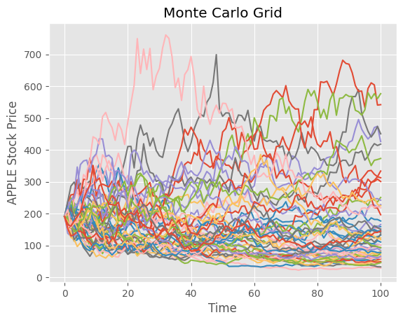
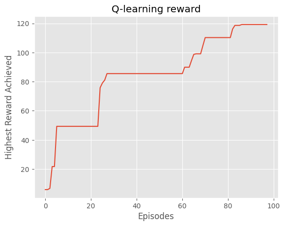
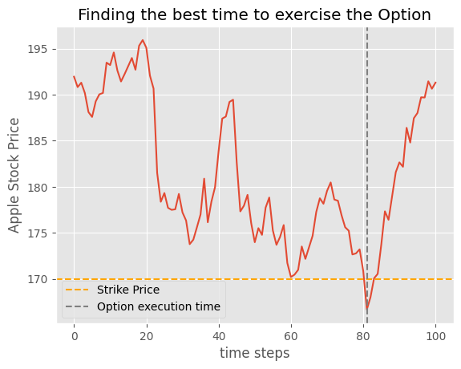

# American Options Pricing with Q-learning

## Overview

This project implements Fitted Q Iteration, a Q-learning-based approach, to price American options. American options are financial derivatives that grant the holder the right, but not the obligation, to buy or sell an underlying asset at a specified price before or at the expiration date (T).

This approach aims to learn an optimal pricing policy Q* for American options. In other words, we seek to understand the optimal action (exercise or hold) to take at each state (financial market condition) to maximize the expected cumulative reward over time. We estimate the continuation value using Laguerre Basis functions and compare it to the return of exercising the option.

 

## Features

- **Monte Carlo Framework:** The project employs Monte Carlo simulation to generate thousands of paths of stock prices, used to train the model.

- **Q-learning Algorithm:** At the core of the project is the Q-learning algorithm, training a model to make optimal decisions for exercising or holding American options.
  
- **American Options Pricing:** The Q-learning model is applied to the specific problem of pricing American options, learning from historical financial data and market conditions to determine the optimal pricing strategy.

- **Agent:** The entity that interacts with the environment, learning to exercise or hold the option to maximize the reward.

- **Data:** Two years of Apple stock data were utilized. Further details about the data, including format and preprocessing, can be found in the project documentation.

## Training

At each step, we used gradient descent to update our estimation of the continuation value. The agent then makes decisions, and the algorithm continuously improves, achieving better rewards as shown below. Note that only better decisions are taken into consideration for updating the model.

  

## Results

This algorithm provides very promising results, discovering opportune times to exercise or hold the option for the right reasons. In the example below, the agent decided to exercise the option at a strategic point, at step 81, resulting in a reward of $3.33.

